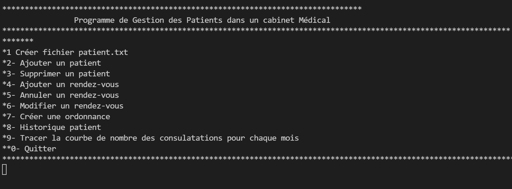

### Medical-Practice
** School Project coded in Python **
# <b> 
 Medical-Practice</b>

**School Project coded in Python**

**ScreenShot**

**Functions**

>>[M_P](#M_P)  

>>[M_P_L](#M_P_L)

>>[Consultation_An](#Consultation_An)

>>[Consulation_Mois](#Consultation_Mois)

>>[Historique_patient](#Historique_patient)

>>[Ordonnance](#Ordonnance)

>>[medicament](#medicament)

>>[Supprimer_patient](#Supprimer_patient)

>>[ajouter_Patient](#ajouter_Patient)

>>[Creation_fichier_patient](#Creation_fichier_patient)

>>[Modify_RDV](#Modify_RDV)

>>[Annuler_RDV](#Annuler_RDV)

>>[Ajouter_RDV](#Ajouter_RDV)

>>[Sexe_verif](#Sexe_verif)

>>[Date_Heure](#Date_Heure)

>>[String_verif](#String_verif)

>>[Age_verif](#Age_verif)

>>[Cin_verif](#Cin_verif)
    
    
#M_P
 
**Main_Program**
 

#M_P_L
 
#Consultation_An
 
#Consulation_Mois
 
#Historique_patient
 
#Ordonnance
 
#medicament
 
#Supprimer_patient
 
#ajouter_Patient
 
#Creation_fichier_patient
 
#Modify_RDV
 
#Annuler_RDV
 
#Ajouter_RDV
 
#Sexe_verif
 
#Date_Heure
 
#String_verif
 
#Age_verif
 
#Cin_verif
